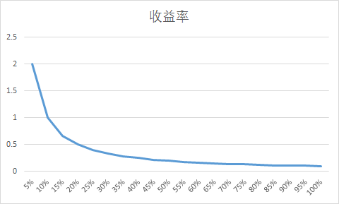
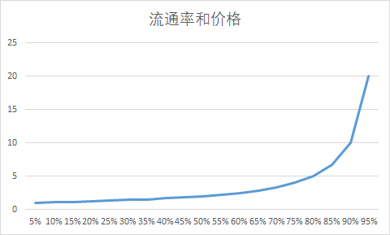

# 按流通量进行通胀奖励的staking经济模型

目前区块链生态中，大多数问题都是由一个中心化的机构进行发行，容易出现单点故障，去中心化的稳定币，能更好的用于支持整个生态的发展，本文提出一个基于去中心化交易所做价格指数，使用智能合约编程进行自适应条件的一个去中心化稳定币系统。

## 原理简述

简述：按整体流通量进行通胀奖励给参与staking用户，鼓励更多人参与staking，提高整个系统的锁仓量，提升整体系统的市值。

基本模型：按照总流通量进行年化10%（具体值可以调整）进行奖励，如果总流通量1亿，那么一年奖励1000万，如果有500万token进行质押，年化收益是200%，如果有1000万进行质押年化收益是100%，随着参与质押的token数量增加，单位token的年化收益率下降。Staking开启时，大部分人都没有质押，初始有很高的年化收益，可能超过500%，会吸引大量持有者进行staking，而后随着参与的人数下降，会降低staking的年化收益率，但是随着参与staking的token数量上升，token的单价会上涨，前期参与staking的人资产会有更大幅度升值。

市场价格的预计：在假设市场的市值不变的情况下，随着锁仓的比例的比高，流通的token减少，剩余的token价格上涨。理想的情况下，随着锁仓率的增加，价格提升，同时进一步带动价格的升值。
价格计算公式：价格=市值/流通量

低质押率的情况下，质押奖励很高，带动用户参与质押，随着质押率提高，价格上升，前期质押用户的收益更多，同时也锁定了低成本的筹码。在理想的情况下，采用该模型，会提高整个系统的市值。

## 参考案例

目前市场staking挖矿规模比较大是ada和dot，ada的质押量在73%，过去一年半上涨50倍，dot质押率在62%，较私募价格上涨54倍。